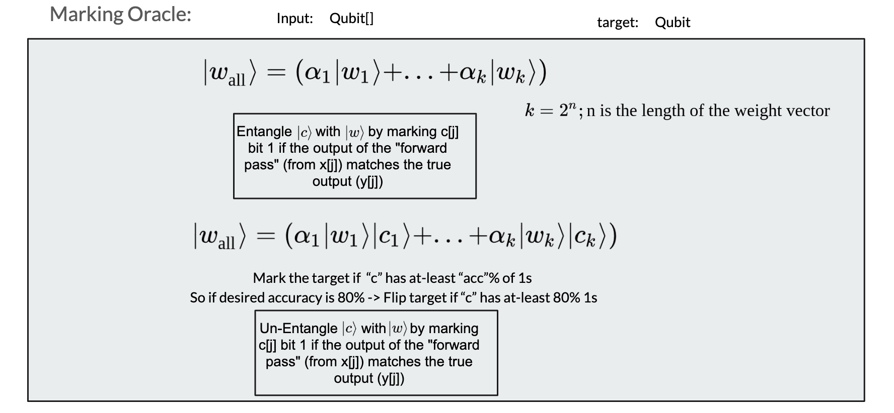
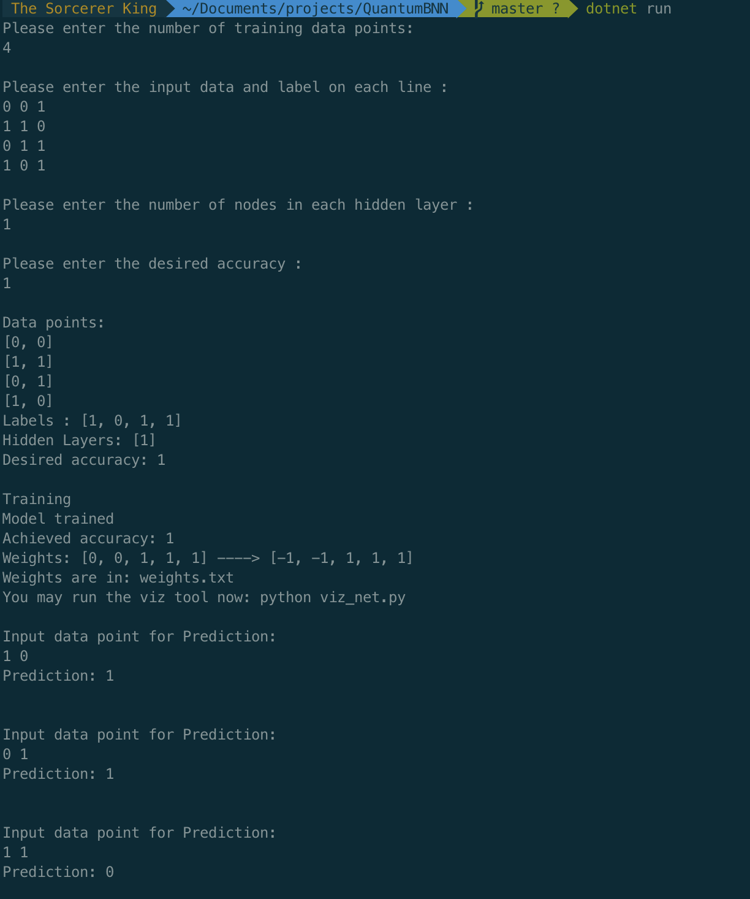

# QuantumBNN
Quantum implementation of the Binary Neural Nets.

# Overview
We describe an algorithm, and an implementation (in the Q# programming language) of Quantum Binary Neural Network. The overall model is based on classical Binary Neural Networks (BNN), but the weights are found by a Quantum subroutine.
Essentially we use Grover’s algorithm to search over all hyper-planes of the weights and find one with sufficient accuracy. Our work primarily contributes to the implementation of a marking oracle, that is able to mark the “correct” set weights. We show that our algorithm and implementation works, by trying to predict the correct weights for the XOR network. The novelty of this work lies in the fact that the entire algorithm is implemented in quantum routine without mocking any critical part.

# Running Things

## Tests
This package comes with an entire suite of tests. It consists of both Unit and Integration testings.

` dotnet test Test.sln `

## Find The Best BNN
We provide a simeple interface for putting in data, defining the number of hidden layers and specify the desired accurracy. This will then run our algorrithm and find the best neural net with the desired accuracy.

`dotnet run`

Given the limitations of Quantum bits we only support 2 bit data, and so the trademark neural net in this case is for the XOR gate
Input arguments in the form of "x1 x2 y". For example "0 0 1", meaning the net takes in x as "0 0" and outputs "1".

# Note
If you use this work please cite this github repo.
